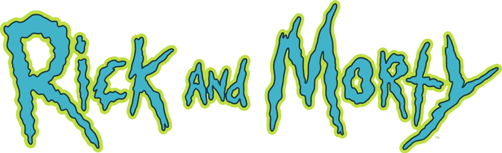
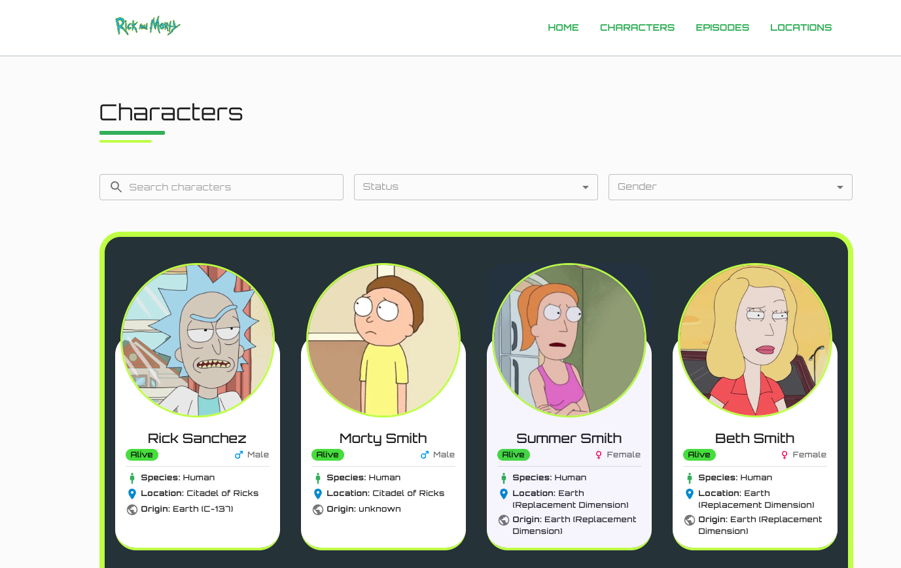

<p align="center">
  
</p>

<p align="center">
  <a href="#-project">Project</a>&nbsp;&nbsp;&nbsp;|&nbsp;&nbsp;&nbsp;
  <a href="#-technologies">Technologies</a>&nbsp;&nbsp;&nbsp;|&nbsp;&nbsp;&nbsp;
  <a href="#-getting-started">Getting Started</a>&nbsp;&nbsp;&nbsp;|&nbsp;&nbsp;&nbsp;
  <a href="#-license">License</a>
</p>

<p align="center">
  
</p>

<p align="center">
  
</p>

## 💻 Project

This is a personal project to study Next.js 16, it's a simple website to show informations about the Rick and Morty TV show.

## ✨ Technologies

The technologies used in this project were:

- [Next.js](https://nextjs.org)
- [Material UI](https://mui.com/material-ui/)
- [Rick and Morty API](https://rickandmortyapi.com/)

## 🚀 Getting Started

**Clone the project**

```bash
git clone https://github.com/FlavioSant/rick-and-morty.git
```

**Install dependencies:**

```bash
npm install
# or
yarn install
# or
pnpm install
```

**Run the development server:**

```bash
npm run dev
# or
yarn dev
# or
pnpm dev
```

Open [http://localhost:3000](http://localhost:3000) with your browser to see the result.

## 📄 License

This project is licensed under the MIT License. See the [LICENSE](LICENSE) file for more details.

---

By Flávio Santos. :heart:

[](https://www.linkedin.com/in/flavio-santos-75487a164/) [](https://www.instagram.com/flavio_santos_/)

This is a [Next.js](https://nextjs.org) project bootstrapped with [`create-next-app`](https://nextjs.org/docs/app/api-reference/cli/create-next-app).
